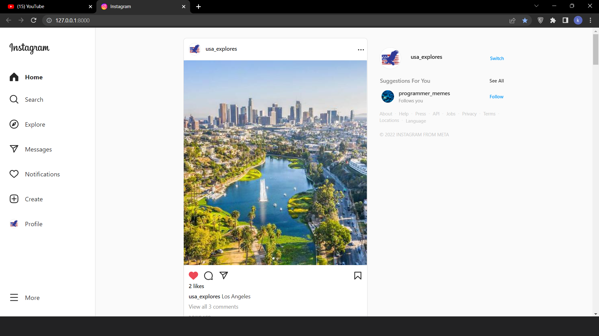

# Instagram - copy of instagram made with Django

A simple, fun and creative way to share photos and messages with friends and family. This is a copy of [instagram](https://www.instagram.com/) website - social network that absolutely everyone knows about. Backend is made using Django framework and Python.


## Table of contents

* [General info](#general-info)
* [Feautures](#feautures)
* [Technologies](#technologies)
* [Running the Project](#running-the-project)
* [Connect PostgreSQL database](#connect-postgresql-database)
* [Set up AWS RDS](set-up-aws-rds)
* [Amazon S3](amazon-s3)
## General Info

Doing this project i learned a lot about Django. I think the best way to learn something, whether it's a new programming language, framework or anything else is practice. Of course you need knowledge as well, but you can't become a developer just after reading a couple of books or watching tutorials on youtube. You need to make something with your own hands, facing a bunch of problems and learn how to solve them. While i was working on this i constanly learned something new and had to rewrite many parts of my code several times. Despite this it still needs some adjustments that i didn't make yet.
## Feautures

This site have all functionality that original instagram have, except of recommendation system and some small amenities.
- create your own account
- share your photos
- search people and follow them
- text your friends
- like and comment any post you want
## Technologies

- Python 3.10.6
- Django 4.1.3
- djangorestframework 3.14.0
- channels 4.0.0
- Pillow 9.5.0
- psycopg2 2.9.6
- Javascript 1.5
- HTML5
- CSS3
## Running the project

**There are 3 accounts with posts, comments, follows and messages if you want to take a quick look of what it all looks like. Usernames and passwords are in 'users.txt' file in the main directory.**

At first, you should have installed Python on your computer. Not necessary, but advised to create a virtual environment, so you store your projects dependecies apart for avoiding conflicts beetwen packages.
```shell
pip install virtualenv
```
Clone this repository and open it in any text editor. To create virtualenv, run the command below in a Windows terminal:
```shell
python -m venv venv
```
or if you're on Linux or Mac:
```shell
virtualenv env
```
To activate virtualenv, run
```shell
venv\Scripts\activate.bat
```
Linux or Mac
```shell
source env/bin/active
```
Than install project dependencies
```shell
pip install -r requirements.txt
```
Now you can run the project (it will run on [localhost](http://127.0.0.1:8000/)):
```shell
python manage.py runserver
```
## Connect PostgreSQL database

At firts, download postgresql from the oficcial [website](https://www.postgresql.org/) and install it. Then go to [pgadmin](https://www.pgadmin.org/), download and install it too.

Launch pgadmin and at first start you need to create your password.

Create a new server.


Create a database.


Go to main_directory > instagram > settings.py. Open this file and find postgresql settings which are commented. Now fill out the fields:

'NAME': your server name;
'USER': your username;
'PASSWORD': your password;
'HOST': 'localhost';
'PORT': 5432.

Now run following commands:
```shell
python manage.py makemigrations
python manage.py migrate
```
## Set up AWS RDS

Open the [website](https://aws.amazon.com/) and create an account (it has a year of free usage). 

Click 'Sign in to the Console', find 'RDS' in serch and click on it.


There will be 'Create database' button. Then setup settings and create your database (you can visit [website](https://django.how/resources/aws-rds-postgresql-instance-for-django-project/) for more detailed guide).

Click on your new database, go to connection and security and copy the 'endpoint'.

Create a new server like before, but in field 'Host name' put the copied endpoint. You should also put this in your postgresql settings in 'settings.py' in 'HOST' instead of localhost. Make sure that other fields match.

Now you can run following commands to apply your tables on AWS database:
```shell
python manage.py makemigrations
python manage.py migrate
```
## Amazon S3
If you want to save your static files on AWS as well, you can read [documentation](https://django-storages.readthedocs.io/en/latest/backends/amazon-S3.html).
